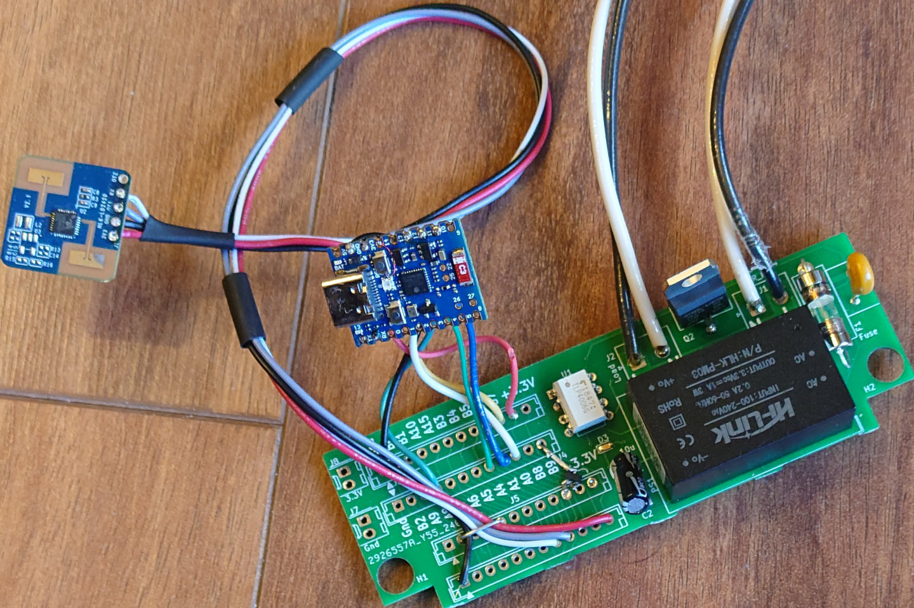
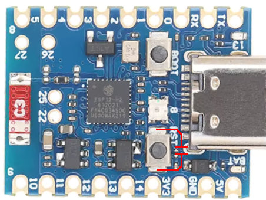
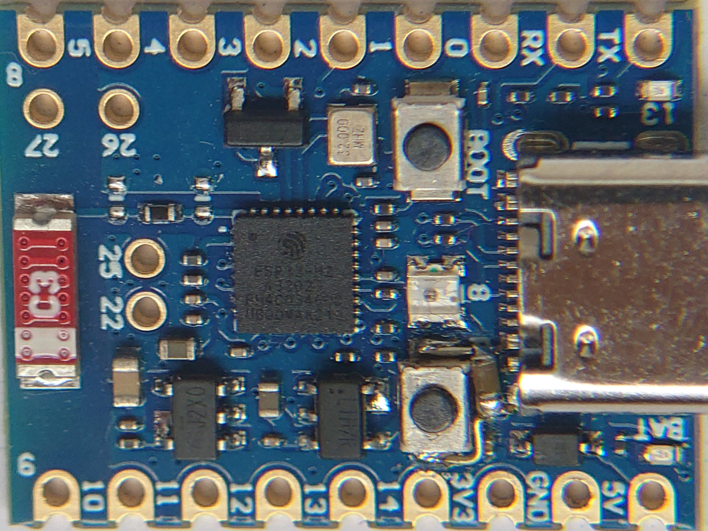
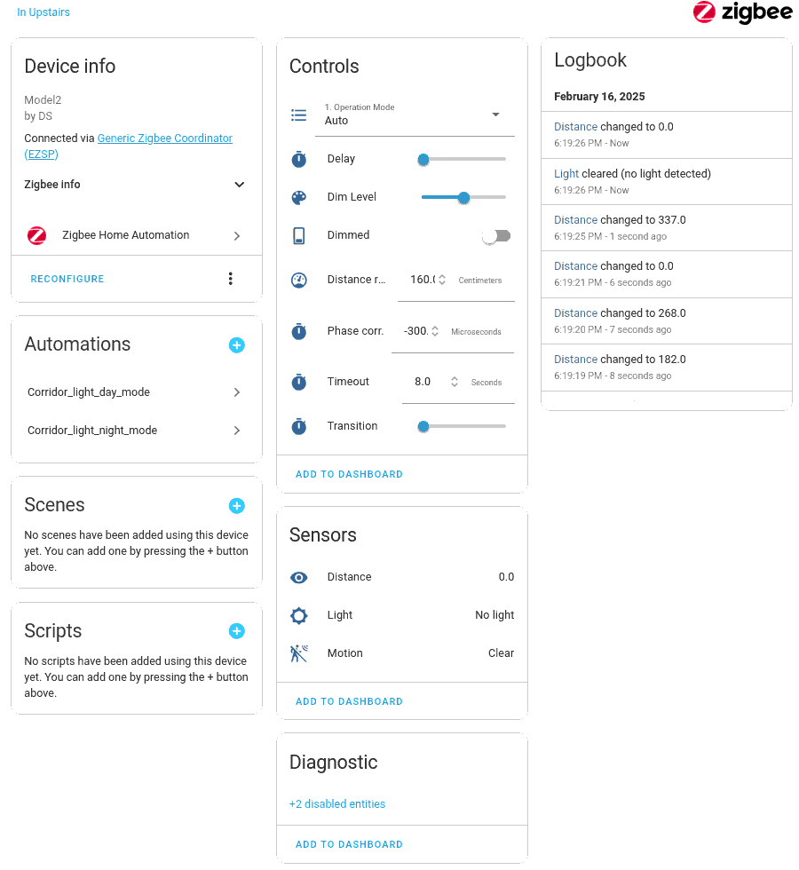

# esp32-zigbee-light
Remotely controlled indoor light powered by ESP32-H2, integrated with Zigbee and Home Assistant.

## Overview
Building the [stm32-zigbee-light project](https://github.com/David-EIPI/stm32-zigbee-light) left me with several spare PCBs. I decided to repurpose them to experiment with Espressif's Zigbee SDK (zSDK). Overall, zSDK is similar to STM's Z-Stack. Programming with zSDK seems to require slightly fewer API calls, though Z-Stack is somewhat better documented.

## Firmware
The project is written in C and built using `idf.py`. It implements a zero-crossing detector for TRIAC-based dimming and supports the **HLK-LD2420S** mmWave motion sensor with adjustable sensing distance. The firmware exposes 6 endpoints and 11 clusters:

- **6 Analog Output clusters** (configuration)
- **1 Analog Input cluster** (detected presence distance)
- **2 Binary Input clusters** (motion state, light state)
- **1 Multistate Value cluster** (operation mode)
- **1 OnOff cluster** (dimming enable control)

### Motion Sensor
The **HiLink LD2420S** is an **mmWave motion sensor** (not a presence sensor). It is more sensitive than traditional PIR sensors and can estimate the approximate distance to a moving object, in addition to detecting motion.

Communication with the sensor is achieved through a standard text-based UART interface. The sensor can be configured with various parameters such as sensitivity, distance range, scanning frequency, etc. This configuration must be done individually for each sensor using the manufacturer's proprietary software. The serial communication protocol is available on the manufacturer's website, but the documentation is brief and somewhat difficult to interpret.

Rather than configuring the sensor internally, I opted to parse its output. The output contains information about both motion detection and the estimated distance to the detected object. In the firmware, this distance is compared against a configurable threshold to trigger a motion detection event. The threshold is adjustable via Zigbee, providing a practical way to control the sensor's sensitivity.

The sensor is powered through a transistor switch, allowing the firmware to power-cycle it when necessary. I used a **PNP** transistor, which proved to be a suboptimal choice. The sensor draws relatively high current (~50-60mA) and is sensitive to supply voltage. Below **3.2V**, it becomes unstable, and its distance measurements become unreliable. Therefore, the transistor base current needs to be sufficiently high to minimize the voltage drop across it to less than **0.1V**. 
A MOSFET would certainly be a more suitable as a switch here.

## Hardware
I re-used the PCB from the [stm32-zigbee-light](https://github.com/David-EIPI/stm32-zigbee-light) project as the power supply and as the base for the TRIAC dimming circuit. Only a few minor modifications were necessary to integrate the **LD2420S** motion sensor.

  
Assembled board.

The control board is based on the **ESP32-H2**. I used a small module called the **ESP32-H2 Super Mini**, designed by **Tenstar Robot**. Despite its compact size, the board provides plenty of accessible GPIOs and works well, with **one exception** that I will describe below. This power-on issue is likely to happen in other circuits with a similar power source.

When powered via **USB**, the **ESP32-H2** boots normally. However, when powered from AC mains via the HiLink AC-DC converter, it fails to start. 

I suspect that the HiLink adapter's output capacitor has a high capacitance, leading to a slow output voltage rise **(low slew rate)**, which interferes with the ESP32-H2 startup sequence.

#### Solution:
I added a **4.7µF capacitor** to the **Enable (EN)** pin to delay the startup, which resolved the issue. The module now boots reliably every time. 

Other capacitor values might work as well, but I did not experiment further.

The board is densely packed, leaving little room for additional components. Furthermore, the **EN pin** is not routed to any easily accessible pad. I managed to solder a **0603** capacitor next to the reset button, but to me this was a fairly tricky soldering task.

  
Capacitor placement is indicated by red lines.

  
Photo of the actual board with the added **4.7µF** capacitor.

## ZHA Quirk
As of now, **ZHA (Zigbee Home Automation)** does not fully support several standard Zigbee clusters required for this project, including:

- **Analog Input cluster**
- **Binary Input cluster**
- **Multistate Value cluster**

Additionally, **present_value** atribute of **Multistate Value** cluster is incorrectly defined as **Float32** instead of **uint16** in the underlying **zigpy** library.

Until these clusters are officially supported in the main **ZHA** integration, a custom **quirk** script is required. This quirk file provides proper cluster handling and also extends supported units for the **Analog Input** cluster, adding **microseconds** as a unit. This is useful for the **Phase Correction** setting in the dimming control.

The quirk file should be placed in Home Assistant configuration directory under custom_zha_quirks.
You may need to restart ZHA integration or Home Assistant for the changes to take effect.

The screenshot below shows the device page with custom entity names:

  
ZHA device page in Home Assistant.

